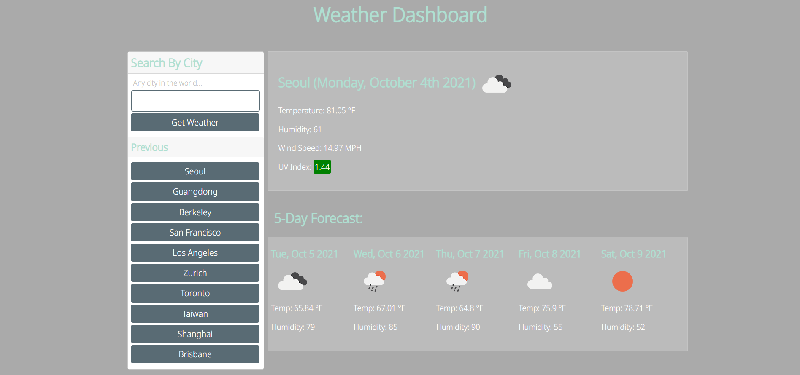

# Updated Portfolio

## Description


This project is an updated version of my portfolio. This time, it utilizes Bootstrap and not just vanilla HTML and CSS. Also, it includes some projects after 3 weeks into the bootcamp. The Bootstrap framework really helped in making the site ultra responsive and makes the code shorter and cleaner. In the updated contact section there is a resume which is available to view.

To view the portfolio, visit this [link](https://mushymane.github.io/updated-portfolio/)

## Technologies Used
- HTML - used to structure and create elements on the DOM
- CSS - styles the HTML elements on page
- Bootstrap - CSS framework
- Git - version control
- Github - where the repository is hosted
- Visual Studio Code - text editor
- Font Awesome - amazing icons
- Google Fonts - for the Cairo and Quicksand fonts
- ScreenToGif - for recording short screen captures

## Code Snippets
HTML - Responsive project cards thanks to Bootstrap classes
```
<div class="row">
            <div class="col-lg-4 col-md-6 col-12 pb-5">
                <div class="card">
                    
                    <div class="card-body">
                        <h5 class="card-title">Weather Dashboard</h5>
                        <p class="card-text">View the weather forecast for cities around the world.</p>
                        <a href="https://mushymane.github.io/weather-dashboard/" class="btn btn-dark"
                            target="_blank">Live</a>
                    </div>
                </div>
            </div>
```
CSS - short and basic styling for the nav-links
```
.navbar-dark .navbar-nav .nav-link.active,
.navbar-dark .navbar-nav .nav-link:hover {
    color: rgb(51, 112, 161) !important;
}
```

## Author Links
[LinkedIn](https://www.linkedin.com/in/luigilantin/)
[Github](https://github.com/mushymane)